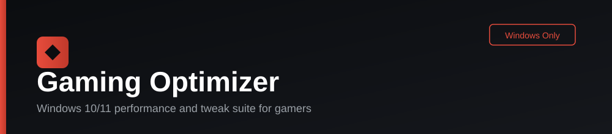

[Uploading README.md…]()
<p align="center">
  
</p>

<p align="center">
  
  
  
  
  
</p>

<p align="center"><b>English</b> · <a href="README.fa.md">فارسی</a></p>

---

## Overview

Gaming Optimizer is a desktop tuning suite for Windows 10 and 11, built for
players who want the same category of control a tool like *Opeasy* gives
them — debloating, registry and BCD tweaks, power plan, GPU, network, RAM
and per-game process priority — packaged as a single native application
with a dark, black-and-red interface and full English/Persian localization.

Every switch in the app maps to a `Tweak` object with `apply()`, `revert()`
and `is_applied()`. Nothing is a one-way action: every change is reversible,
and every tab performs a background scan on open so switches for settings
that are already applied (whether through this app, manually, or by another
tool) light up automatically instead of asking you to redo work you already did.

## Contents

- [Features](#features)
- [Requirements](#requirements)
- [Getting started](#getting-started)
- [Building a standalone .exe](#building-a-standalone-exe)
- [Project architecture](#project-architecture)
- [Design notes](#design-notes)
- [Localization](#localization)
- [Safety](#safety)
- [Contributing](#contributing)
- [License](#license)

## Features

| Module | What it does |
|---|---|
| Start | Creates a System Restore Point and a registry export before anything else runs; removes bundled/unwanted apps; disables Windows Update. |
| Registry & BCD Tweaks | Curated registry and `bcdedit` changes aimed at input latency, responsiveness and boot behavior. |
| Windows Settings | Batches the Windows-side settings that matter for gaming (visual effects, notifications, background activity, and more). |
| Control Panel | Sound, mouse and graphics-related Control Panel settings, applied without opening Control Panel by hand. |
| Power Plan | Creates and activates a high-performance power plan tuned for gaming. |
| GPU Setting | Vendor-aware GPU driver settings with an auto-detected NVIDIA / AMD / Intel path. |
| GPU Vendor Guide | Step-by-step best-practice guidance for NVIDIA Control Panel, AMD Software and Intel Graphics Command Center. |
| Game Presets | Browse 100 popular titles with poster art and open a curated best-settings guide per game. |
| Clean Up | Frees disk space and speeds up Windows startup; can also trigger the built-in Disk Cleanup (`cleanmgr`). |
| Unwanted Services | Disables Windows services that add background overhead without value for a gaming machine. |
| MSI Mode Tools | Switches supported GPU / storage / network / USB controllers to Message-Signaled Interrupts. |
| GPU Tweaks | Additional low-level GPU registry tuning beyond the vendor control panel. |
| Network Tweak | TCP/IP stack and adapter tuning aimed at reducing latency. |
| Ram Process | Frees and manages RAM used by background processes. |
| Adobe High Performance | Applies the GPU/CPU performance profile Adobe apps support, for creators who also game on the same machine. |
| Game High Priority | Sets CPU priority for a chosen game executable, or generates a standalone `GameHighPriority.reg` file you can double-click later. |
| Startup / Autorun Apps | Scans Registry Run keys, the Startup folder and scheduled "at logon" tasks in one list; disabling never deletes anything, it only relocates the entry so it can be restored exactly. |

## Requirements

- Windows 10 or Windows 11
- Python 3.10 or later (only if running from source; the packaged `.exe` needs nothing installed)
- Administrator rights — the app relaunches itself with a UAC prompt automatically, because registry and service changes require it

## Getting started

```bash
pip install -r requirements.txt
python main.py
```

On first launch you will be asked to pick a language (English or Persian);
that choice is used for the rest of the session.

## Building a standalone .exe

```bash
pyinstaller --noconfirm --onefile --windowed --name "GamingOptimizer" ^
    --add-data "assets;assets" main.py
```

The output binary is written to `dist/GamingOptimizer.exe`.

## Project architecture

```
core/            Engines: registry, services, PowerShell bridge, backups, MSI mode,
                 startup apps, i18n, and the shared black/red color theme
data/            Every tab's tweak list as plain Tweak objects, kept separate from UI
ui/              Shared UI components: sidebar, generic tweak list, splash, progress dialog
tabs/            One file per sidebar section; most just wire data/*.py into GenericTweakTab
assets/
  icons/         Sidebar icons, generated with core/icon_generator.py
  posters/       Game cover art for the Game Presets tab
  theme/         black_red.json — the CustomTkinter color theme used app-wide
  readme/        Small SVG icons used in this document
```

## Design notes

**Why every tweak is a `Tweak` object.** Each item exposes `apply()`,
`revert()` and `is_applied()`. That gives three things for free: a backup of
the previous value before any change lands (under
`%PROGRAMDATA%\GamingOptimizer\backups\*.json`), a "Restore Defaults" button
that always works — including for registry values that never existed before
(they get removed cleanly, not zeroed out) — and an accurate on-open scan
that reflects the real state of the machine.

**Why the sidebar uses generated icons instead of screenshots.** Screenshots
of the NVIDIA Control Panel, AMD Software or the Windows Settings UI are
copyrighted by their respective vendors, and shipping them inside a
redistributed app is a legal risk worth avoiding. Instead, a single
consistent icon set is generated with Pillow (`core/icon_generator.py`,
regenerate with `python -m core.icon_generator`).

**Color theme.** The whole UI reads its color palette from
`assets/theme/black_red.json` (loaded via `core/theme.py`), so every
default-styled widget — buttons, switches, progress bars, scrollbars —
follows the same black-and-red look instead of falling back to a toolkit
default. Re-theming the app means editing that one file.

## Localization

Language is chosen once, on the splash screen, before the main window is
built — so nothing needs to re-render mid-session. UI strings are resolved
through `core/i18n.py`; tweak names and descriptions default to Persian
(the canonical copy) with English overrides layered on top.

## Safety

<p>
  
  This application modifies the Windows registry, boot configuration and
  system services. Always let the Start tab create a System Restore Point
  before applying anything, and only enable switches you understand.
</p>

## Contributing

Issues and pull requests are welcome. Please keep new tweaks as `Tweak`
objects in `data/`, keep UI code in `ui/`/`tabs/`, and run the app on a real
Windows machine before submitting changes that touch `core/`.

## License

Released under the [MIT License](LICENSE).
